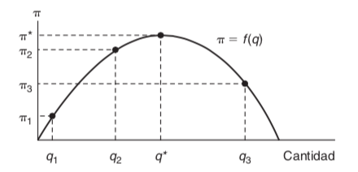
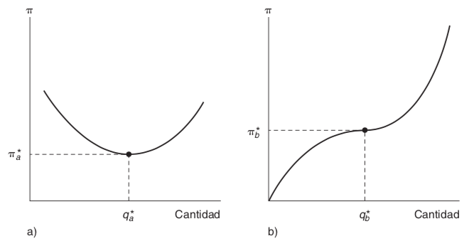

# Maximización de una función con una Variable.

Comencemos con un ejemplo sencillo. Suponga que el administrados de una empresa quiere maximizar las ganancias que obtendrá de la venta de un bien determinado. Llamemos a estas ganancias $(\pi)$  que dependeran de la cantidad $(q)$ que venden de ese bien. Matemáticamente, esto es 
$$\pi = f(q)$$
La siguiente figura muestra una posible relación entre $\pi$ y $q$. Es evidente que para obtener la ganancia máxima, el administrador debe producir $q^*$, con lo cual obtendrá $\pi^*$ ganancias. 

## Derivada 

La derivada de una función $\pi = f(q)$ en el punto $q_1$ se define como 
$$\frac{d \pi}{d q} = \frac{d f}{dq} = \lim_{h\rightarrow 0}\frac{f(q_1 + h) - f(q_1)}{h}$$
Observe que el valor de este cociente depende claramente del punto $q_1$ que se elija. 

En la figura anterior: 
$$\left.\begin{array}{c}\frac{d \pi}{d q}\end{array}\right|_{q = q_1}> 0$$
mientras que 
$$\left.\begin{array}{c}\frac{d \pi}{d q}\end{array}\right|_{q = q_3} < 0$$

¿Cuál es el valor de $\frac{d \pi}{d q}$ en $q^*$? Debería ser igual a cero, porque los valores $q$ inferiores a $q^*$ tiene un valor positivo y los superiores a $q^*$ tienen un valor negativo. La derivada es la pendiente de la curva en cuestión; es decir, esta pendiente es positiva a la izquierda de $q^*$ y negativa a la derech en $q^*$. En el punto $q^*$, la pendiente de $f(q)$ es 0. 

## Condición de primer orden para el máximo.

Para que la función de una variable alcance su valor máximo en un punto, la derivada en un punto (si existe) deber ser cero. En un punto óptimo (por decir $q^*$), se cumplira que 
$$\left.\begin{array}{c}\frac{d \pi}{d q}\end{array}\right|_{q = q^*} = 0\hspace{1cm}(1)$$

Sin embargo, la aplicación ingenua de esta única regla le podría engañar. Por ejemplo,  suponga que la función de ganancias tiene una de las formas que representa la figura a) o b). 

Si la función de las ganancias es la que muestra la figura a), entonces al producir donde $\frac{d \pi}{dq} = 0$, elegiría el punto $q_a^*$. Este punto de hecho, le proporcionará un mínimo y no un máximo de ganancias. Por otra parte, si la función de ganancias es la opción b) que se muestra en la figura, entonces el administrador eligiría el punto $q_b^*$ que, si bien le ofrece una ganancia superior a la de cualquier nivel de produción inferior a $q_b^*$, sin duda es inferior a cualquier  producción superior a $q_b^*$. Esta situaciones indican el hecho matemático de que $\frac{d\pi}{dq} = 0$  es una condición necesaria para alcanzar un máximo, pero no es una condición suficiente. Para asegurarnos de que el punto elegido es, en efecto, un punto máximo, es preciso imponer una segunda condición. 

## Segundas Derivadas

Se dice que la derivada de una derivada es la segunda derivada y se escribe así: 

$$\frac{d^2\pi}{dq^2}\hspace{0.2cm}o\hspace{0.2cm} \frac{d^2f}{dq^2}\hspace{0.2cm}o\hspace{0.2cm} f^{\prime\prime}(q)$$
Por tanto, la condición adicionalmente para que $q^*$ represente un máximo (local) es
$$\left.\begin{array}{c}\frac{d^2 \pi}{d q^2}\end{array}\right|_{q = q^*} = \left.\begin{array}{c}f^{\prime\prime}(q)\end{array}\right|_{q = q^*} < 0\hspace{1cm}(2)$$

donde la notación nos recuerda, de nueva cuenta, que se debe calcular esta segunda derivada para el punto $q^*$. 

De aquí que, aun cuando la ecuación (1) $(\frac{d\pi}{dq} = 0)$ es una condición necesaria para alcanzar el máximo, se debe combinar combinar con la ecuación (2) $\frac{d^2\pi}{dq^2} < 0$ para asegurarnos que el punto es un máximo local de l función. 

Por tanto, las ecuaciones (1) y (2) juntas  son, por tanto, condiciones suficientes para alcanzar este máximo. 

## Funciones con varias variables

Los problemas económicos no suelen implicar funciones de una sola variable. La mayor parte de las metas que interesan a los agentes económicos dependen de varias variables y ellos deben elegir de entre éstas.  Por ejemplo, la `utilidad` que obtiene un individuo de sus actividades como consumidor dependerá de la cantidad que consuma de cada bien. En el caso de la función de `producción` de una empresa, la cantidad producida dependerá de la cantidad de trabajo, capital y tierra dedicados a la producción. En estas circunstancias, el hecho de que esta variable $(y)$ dependa de una serie de otras variables $(x_1, x_2, . . . , x_n)$ es escribe 
$$y = f(x_1,x_2, . . . , x_n)$$

### Derivadas Parciales 

Nos interesa calcular el punto en el cual $y$ alcanza su valor máximo, así como los intercambios que se deben hacer para alcanzar ese punto. De nuevo, resultaría más fácil pensar que el agente cambia las variables que están a su disposición (las $x$) para poder encontrar un máximo. Por desgracia, con una función de varias variables, la idea de la derivada  no esta bien definida. Tal como la pendiente de ascensión a una montaña dependerá de la dirección que se lleve la pendiente o la derivada de una función dependerá de la función que se elija. Por lo general, las únicas pendientes direccionales de interés son las que se obtienen aumentando una de las x mientras que todas las demás variables permanecen constantes. Estas pendientes direccionales se denominan derivadas parciales. La derivada de $y$ respecto a $x_1$ se escribe como

$$\frac{\partial y}{\partial x_1}\hspace{0.2cm}o\hspace{0.2cm}\frac{\partial f}{\partial x_1}\hspace{0.2cm}o\hspace{0.2cm} f_{x_{1}}\hspace{0.2cm}o\hspace{0.2cm}f_1$$

Queda entendido que al calcular esta derivada se mantiene constante el valor de todas las demás $x$. De nuevo, es preciso destacar que el valor  numérico de esta pendiente depende del valor que tome $x_1$ y del valor (predeterminado) de $x_2, . . . , x_n$. 

Una definición algo más formal de la derivada parcial es 

$$\left.\begin{array}{c}\frac{df}{dx_1}\end{array}\right|_{\overline{x}_2, . . . , \overline{x}_{n}} = \lim_{h\rightarrow 0} \frac{f(x_1 + h, \overline{x}_2, . . . , \overline{x}_n) - f(x_1, \overline{x}_2, . . . , \overline{x}_n)}{h}$$
donde la notación indica que $x_{2}, . . . , x_n$ se mantienen constantes en los valores predeterminados $\overline{x}_2, . . . , \overline{x}_n$ de forma que podamos estudiar únicamente el efecto del cambio $x_1$. 